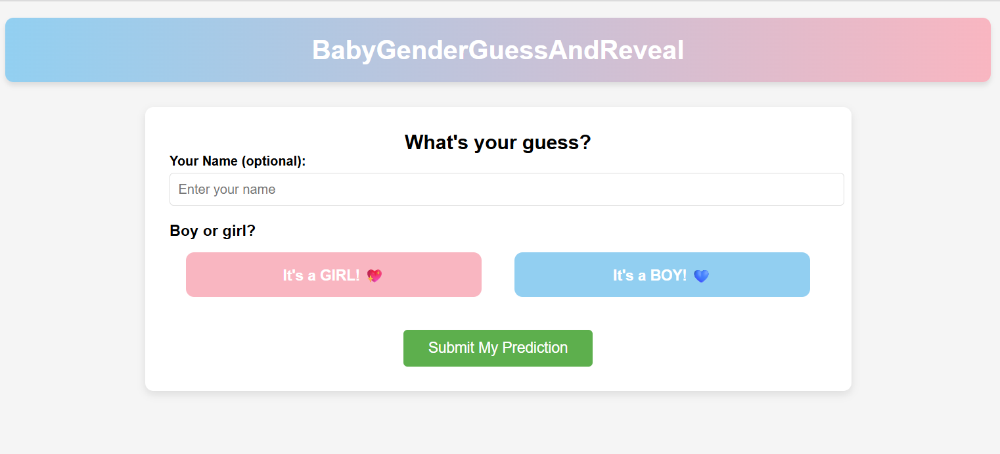
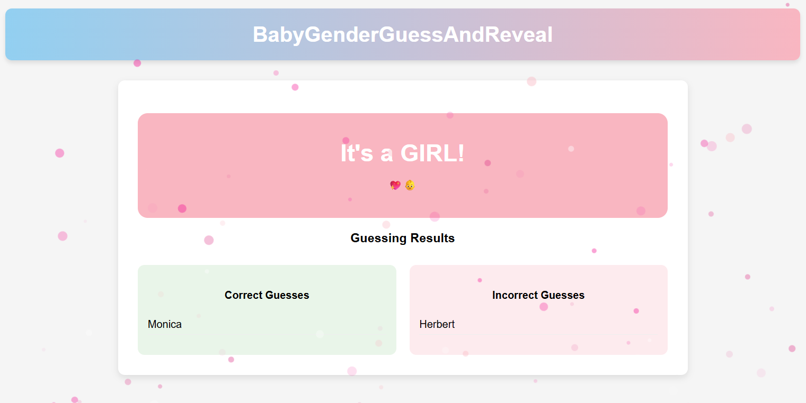

# BabyGenderGuessAndReveal

**BabyGenderGuessAndReveal** is a small full-stack app for a **gender reveal party**: guests vote boy or girl, see live counts on a results page, and hosts manage everything from a **secret setup URL** (not linked from the public vote UI).

| | |
| --- | --- |
| **Frontend** | React 19 (Create React App), React Router, Recharts, Axios |
| **Backend** | Flask, SQLite, Flask-CORS |
| **Data** | One vote per browser (cookie + `voter_id`), optional display name; UI text/colours/hero image in SQLite |


## Features

- **Vote** (`/`) — Guest page: optional name, boy/girl guess. Custom copy, colours, and hero photo come from the setup screen.
- **Results** (`/results`) — Live chart before reveal; optional **scheduled reveal countdown** (set in setup). You can enable **auto-reveal** so the server applies the gender at the scheduled time (no manual “Reveal” click). The server checks the schedule when **results are polled** or **someone votes**—keep the results page open or expect traffic near go-time. After reveal, big announcement + correct/incorrect name lists. Guests can **save a PNG** of the reveal card and download **JSON** or **CSV** summaries.
- **Setup** (`/setup/<slug>`) — Host-only hub (see below): text, colours, photo upload, optional **celebration audio** for the results reveal, optional **guest password** for `/` and `/results`, reveal, reset, view/delete votes. **`ADMIN_KEY`** required for every action that changes data.
- **Guest password** (optional) — If enabled in **Guest access**, visitors hitting `/` or `/results` see a password screen first. The **`/setup/...`** URL is **not** gated so hosts can always configure the party. Password is stored hashed; set **`SECRET_KEY`** in `backend/.env` so guest session cookies are signed consistently (especially in production).

## Screenshots

Sample UI from the repo’s [`sampleImages/`](sampleImages/) folder (your theme will match whatever you set in setup).

**Guest vote** (`/`) — name (optional), boy/girl buttons, submit.



**Results after reveal** (`/results`) — announcement, stats, correct/incorrect guesses, and export actions.



## Secret setup link

1. Choose a **slug** (e.g. `smith-party-2025`). Put the same value in **`frontend/.env`** as `REACT_APP_ADMIN_SETUP_PATH` before `npm start` / `npm run build`.
2. Share **`https://<your-host>/setup/<slug>`** only with people who should manage the event. Do **not** share this link in the same place as the public vote link.
3. The **guest voting link** is simply the site root: **`https://<your-host>/`** — that’s what you send to everyone who votes.

`ADMIN_KEY` (in `backend/.env`) is still required for all admin APIs; the slug only hides the setup UI from casual browsing.

Legacy paths **`/admin/*`** redirect to `/setup/<default-slug>` (default slug is `dev` if env is unset).

## Quick start (development)

Two terminals: API on **5000**, React on **3000**. Dev proxy (`src/setupProxy.js`) forwards **`/api`** and **`/uploads`** to Flask.

### 1. Backend

```bash
cd backend
python -m venv .venv
# Windows: .venv\Scripts\activate
# macOS/Linux: source .venv/bin/activate
pip install -r requirements.txt
copy .env.example .env   # Windows; use cp on Unix
```

Edit `backend/.env` and set a strong **`ADMIN_KEY`** and a **`SECRET_KEY`** (any long random string; used to sign guest unlock cookies). Then:

```bash
python app.py
```

The database file `backend/gender_reveal.db` is created on first run. Uploaded images go under `backend/uploads/` (gitignored).

### 2. Frontend

```bash
cd frontend
copy .env.example .env   # optional: set REACT_APP_ADMIN_SETUP_PATH
npm install
npm start
```

Open [http://localhost:3000/](http://localhost:3000/) for guests, and [http://localhost:3000/setup/dev](http://localhost:3000/setup/dev) for setup (default slug **`dev`** if `REACT_APP_ADMIN_SETUP_PATH` is not set).

## Production-style run (single server)

Set `REACT_APP_ADMIN_SETUP_PATH` (and any other `REACT_APP_*` vars), then build — they are **baked in at build time**.

```bash
cd frontend && npm install && npm run build
cd ../backend
# ensure .env has ADMIN_KEY set
python app.py
```

Visit [http://localhost:5000](http://localhost:5000). Open the setup screen at `/setup/` plus your chosen slug (same as `REACT_APP_ADMIN_SETUP_PATH`). In production, turn off Flask `debug`, use a reverse proxy + HTTPS, and **change the default slug** to something unguessable.

## Security notes for a public repo

- **Change `ADMIN_KEY`** and **choose a non-default `REACT_APP_ADMIN_SETUP_PATH`** before any real deployment; never commit `backend/.env` or `frontend/.env`.
- **Admin APIs** (`/api/admin/*`) require `ADMIN_KEY` via `X-Admin-Key` or JSON `admin_key` where applicable. `GET /api/admin/party-status` returns vote/reveal counts without the guest-password gate (for the setup screen). `GET /api/admin/config` returns the full config (including auto-reveal gender); **`scheduled_reveal_gender` is never included in public `GET /api/config`** so guests cannot scrape the answer.
- **Guest password** is party-level (shared with everyone who should vote); it is not as strong as real auth — use **`ADMIN_KEY`**, **`SECRET_KEY`**, HTTPS, and a hard-to-guess setup slug for real protection.
- The setup **slug** is not a cryptographic secret; it only obscures the admin UI.
- Vote identity uses cookies; treat this as a fun party tool, not a high-assurance ballot.

## Project layout

```
.
├── README.md
├── sampleImages/         # screenshots used in this README
├── backend/
│   ├── app.py
│   ├── schema.sql
│   ├── requirements.txt
│   ├── uploads/          (created at runtime, gitignored)
│   └── .env.example
└── frontend/
    ├── src/
    │   ├── setupProxy.js   (dev: proxy /api and /uploads)
    │   └── …
    └── .env.example
```

## License

[MIT](LICENSE)
